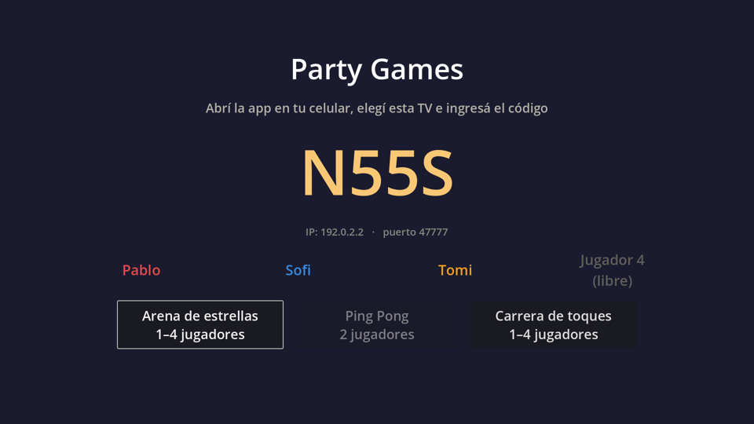
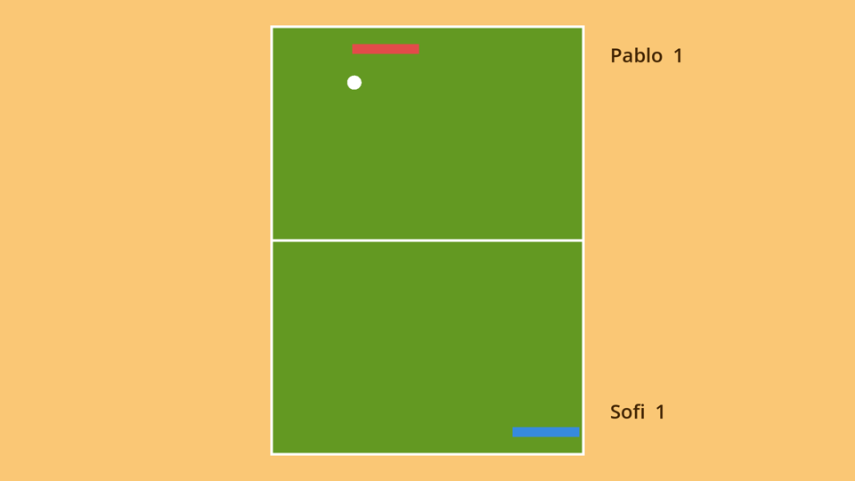

# Party Games

Juegos cortos para **1 a 4 jugadores en el sillón**: la **TV es la pantalla** y los **celulares son los controles**. Un solo proyecto de Godot 4 que corre en los dos lados.

| TV (host) | Celular (control) |
|---|---|
|  |  |
|  |  |

> Capturas generadas automáticamente desde el propio proyecto (host + controles reales conectados por WebSocket).

## Estado

**v0.1 · Prototipo técnico funcionando.** Incluye:

- Conexión TV ↔ celulares por Wi-Fi local, con código de sala, reconexión automática y medición de latencia.
- Descubrimiento automático de la TV en la red (con IP manual como respaldo).
- 3 minijuegos, cada uno con un tipo de control distinto:
  - **Arena de estrellas** (1–4) · joystick
  - **Ping Pong** (2) · slider horizontal
  - **Carrera de toques** (1–4) · un botón
- Lobby navegable con el control remoto de la TV (D-pad).
- 265 verificaciones automáticas (unitarias + integración real de red) y CI en GitHub Actions.

## Probarlo en 2 minutos (en tu PC)

1. Instalá [Godot 4.4](https://godotengine.org/download) (versión estándar, no .NET).
2. Cloná el repo y abrí `project.godot` con Godot.
3. Abrí dos ventanas del juego:
   - **Depurar → Personalizar instancias de ejecución** → 2 instancias. Argumentos: `-- --host` en una y `-- --controller` en la otra.
   - O por consola:
     ```bash
     godot --path . -- --host          # ventana "TV"
     godot --path . -- --controller    # ventana "celular"
     ```
4. En la ventana del control: elegí la TV de la lista (o escribí `127.0.0.1`), poné un apodo y el código que muestra la TV.
5. En la TV elegí un juego con flechas + Enter. Con el mouse arrastrás como si fuera el dedo.

Para probar con celulares reales ver [docs/BUILD.md](docs/BUILD.md).

## Tests

```bash
godot --headless --path . --import                       # la primera vez
godot --headless --path . -s res://tests/run_tests.gd    # 0 = todo OK
```

## Documentación

| Documento | Para qué |
|---|---|
| [docs/ARCHITECTURE.md](docs/ARCHITECTURE.md) | Cómo está armado y por qué (con conceptos explicados) |
| [docs/PROTOCOL.md](docs/PROTOCOL.md) | Contrato de mensajes TV ↔ celular |
| [docs/ADDING_A_MINIGAME.md](docs/ADDING_A_MINIGAME.md) | Guía paso a paso para sumar un juego |
| [docs/SECURITY.md](docs/SECURITY.md) | Modelo de amenazas y controles |
| [docs/BUILD.md](docs/BUILD.md) | Exportar a Android, Google TV e iOS |
| [docs/ROADMAP.md](docs/ROADMAP.md) | Qué sigue |
| [docs/adr/](docs/adr/) | Decisiones de arquitectura registradas |
| [CLAUDE.md](CLAUDE.md) | Contexto para seguir el desarrollo con Claude Code |

## Estructura

```
app/            Punto de entrada: decide si arranca como TV o como control
core/protocol/  Contrato de mensajes compartido (única fuente de verdad)
host/           Todo lo que corre en la TV
  network/        Servidor WebSocket + anuncio en la red
  minigames/      Un juego por carpeta + registro
  host_main.gd    Lobby y flujo de la sesión
controller/     Todo lo que corre en el celular
  network/        Cliente WebSocket + búsqueda de TVs
  layouts/        Joystick, slider, botón
tests/          Tests automáticos (headless)
docs/           Documentación
```
