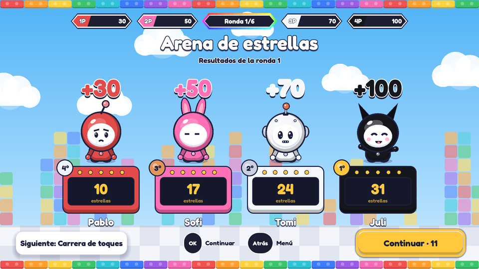
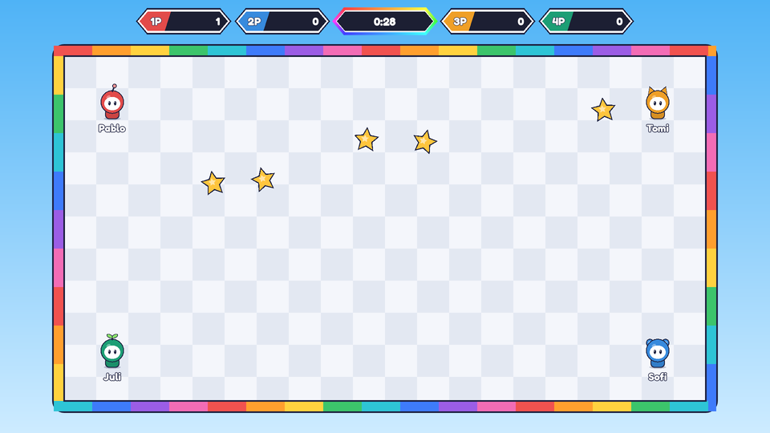
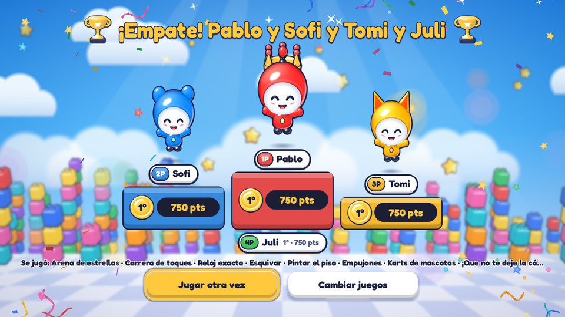
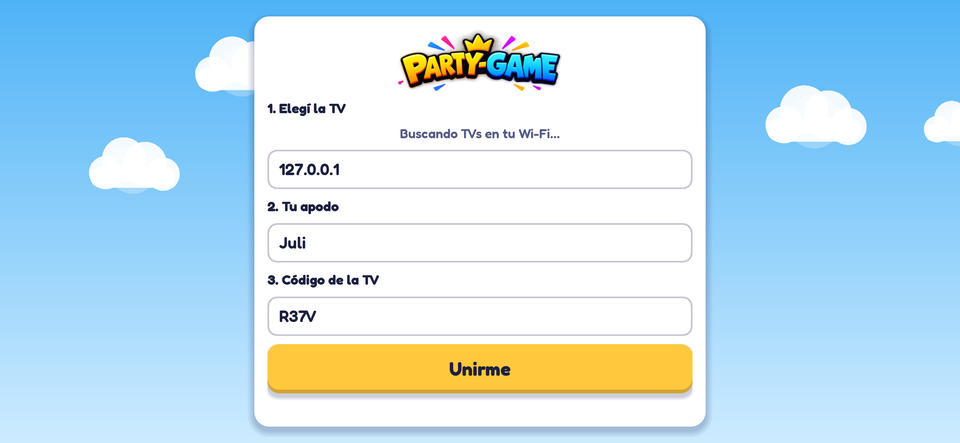
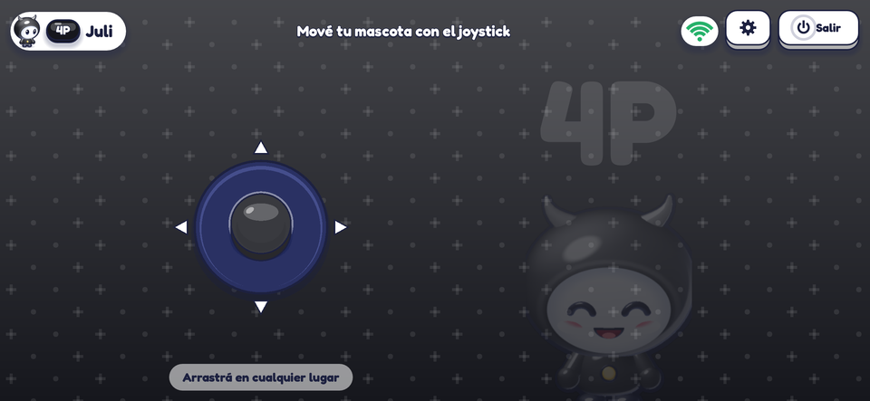

# Party Games

Juegos cortos para **1 a 4 jugadores en el sillón**: la **TV es la pantalla** y los **celulares son los controles**. Un solo proyecto de Godot 4 que corre en los dos lados.

| TV (host) | |
|---|---|
|  |  |
|  |  |

| Celular (control) | |
|---|---|
|  |  |

> Capturas generadas automáticamente desde el propio proyecto (host + controles reales conectados por WebSocket) con `tools/capture_screens.gd`. La CI las vuelve a generar en cada PR (artefacto `capturas`).

## Estado

**v0.2 · Modo competencia y sistema visual.** Incluye:

- Conexión TV ↔ celulares por Wi-Fi local, con código de sala, reconexión automática y medición de latencia.
- Descubrimiento automático de la TV en la red (con IP manual como respaldo).
- **Modo competencia**: en el lobby se elige **cuántos juegan** (1–4) y **qué minijuegos entran**; después de cada juego, **resumen por jugador** con puesto, puntaje y puntos ganados; al final, **podio**. Puntos por posición (1° 100 · 2° 70 · 3° 50 · 4° 30).
- 3 minijuegos, cada uno con un tipo de control distinto:
  - **Arena de estrellas** (1–4) · joystick
  - **Ping Pong** (2) · slider horizontal
  - **Carrera de toques** (1–4) · un botón
  - **Reloj exacto** (1–4) · un botón
- Sistema visual propio: tipografía Fredoka, mascotas por jugador (distinguibles también sin color), marcadores hexagonales, fondos animados. Todo dibujado por código.
- Toda la TV se maneja con el control remoto (D-pad), con menú de pausa en "Atrás".
- 323 verificaciones automáticas (unitarias + integración real de red + flujo completo de la TV), compilación de todos los scripts y prueba de humo visual en CI.

## Probarlo en 2 minutos (en tu PC)

1. Instalá [Godot 4.4](https://godotengine.org/download) (versión estándar, no .NET).
2. Cloná el repo y abrí `project.godot` con Godot.
3. Abrí dos ventanas del juego:
   - **Depurar → Personalizar instancias de ejecución** → 2 instancias. Argumentos: `-- --host` en una y `-- --controller` en la otra.
   - O por consola:
     ```bash
     godot --path . -- --host          # ventana "TV"
     godot --path . -- --controller    # ventana "celular"
     ```
4. En la ventana del control: elegí la TV de la lista (o escribí `127.0.0.1`), poné un apodo y el código que muestra la TV.
5. En la TV elegí cuántos juegan (◀ ▶ sobre el selector), marcá los juegos con Enter y apretá **¡A jugar!**. Con el mouse arrastrás como si fuera el dedo. Escape = botón "Atrás" (menú de pausa).

Para probar con celulares reales ver [docs/BUILD.md](docs/BUILD.md).

## Tests

```bash
godot --headless --path . --import                       # la primera vez
godot --headless --path . -s res://tests/run_tests.gd    # 0 = todo OK
```

## Documentación

| Documento | Para qué |
|---|---|
| [docs/ARCHITECTURE.md](docs/ARCHITECTURE.md) | Cómo está armado y por qué (con conceptos explicados) |
| [docs/PROTOCOL.md](docs/PROTOCOL.md) | Contrato de mensajes TV ↔ celular |
| [docs/ADDING_A_MINIGAME.md](docs/ADDING_A_MINIGAME.md) | Guía paso a paso para sumar un juego |
| [docs/SECURITY.md](docs/SECURITY.md) | Modelo de amenazas y controles |
| [docs/BUILD.md](docs/BUILD.md) | Exportar a Android, Google TV e iOS |
| [docs/ROADMAP.md](docs/ROADMAP.md) | Qué sigue |
| [docs/adr/](docs/adr/) | Decisiones de arquitectura registradas |
| [docs/SKILLS.md](docs/SKILLS.md) | Qué skills de Claude Code usa el proyecto y por qué |
| [CLAUDE.md](CLAUDE.md) | Contexto para seguir el desarrollo con Claude Code |

## Estructura

```
app/            Punto de entrada: decide si arranca como TV o como control
assets/fonts/   Tipografía Fredoka (licencia OFL incluida)
core/protocol/  Contrato de mensajes compartido (única fuente de verdad)
core/ui/        Sistema visual: tokens, tema, mascotas, fondo, chips
host/           Todo lo que corre en la TV
  network/        Servidor WebSocket + anuncio en la red
  minigames/      Un juego por carpeta + registro
  tournament/     Modo competencia (puntos y rondas, lógica pura)
  ui/             Pantallas: lobby, resumen de ronda, podio, pausa
  host_main.gd    Orquesta las fases de la sesión
controller/     Todo lo que corre en el celular
  network/        Cliente WebSocket + búsqueda de TVs
  layouts/        Joystick, slider, botón
tests/          Tests automáticos (headless)
tools/          Capturas automáticas de pantalla (prueba de humo visual)
.claude/        Skills y hook de inicio para Claude Code
docs/           Documentación
```

## Licencia

- **Código:** [MIT](LICENSE) · © 2026 vepamusic11. Podés usarlo y modificarlo manteniendo el aviso de copyright.
- **Nombre, logo y personajes:** reservados; ver [TRADEMARKS.md](TRADEMARKS.md).
- **Tipografía [Fredoka](https://fonts.google.com/specimen/Fredoka):** © The Fredoka Project Authors · [SIL Open Font License 1.1](assets/fonts/OFL.txt).
