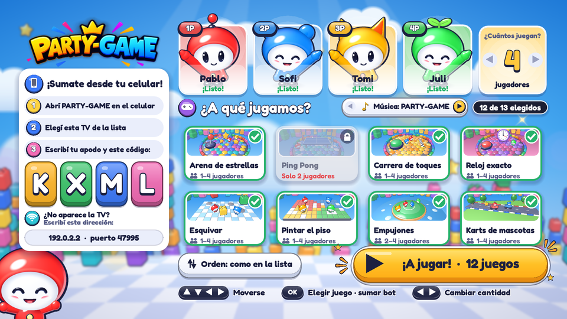
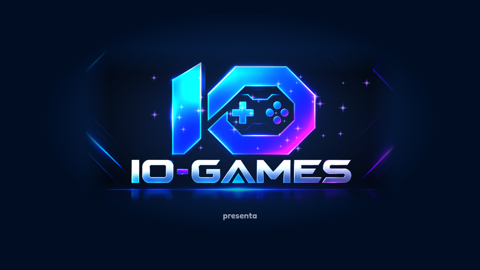

# Lobby de la TV · referencia de diseño

Maqueta aprobada (26/09/2026) y cómo se tradujo al lobby dibujado por código.

| Zona de la maqueta | Implementación |
|---|---|
| Logo PARTY-GAME arriba a la izquierda | `UiTheme.logo_rect()` con `assets/brand/party_game_logo.png` |
| "¡Sumate desde tu celular!" con ícono de celular | `GlyphBadge("phone")` (círculo con bisel) + tres pasos numerados en píldoras, letra de 26 px (`_step_row`) |
| Código de sala en fichas de colores | `_CodeTile`: bloque de 100×128 px con `UiTheme.draw_bevel` (contorno, labio oscuro abajo, luz arriba en degradé y brillo) y la letra blanca con contorno, como el logo |
| "¿No aparece la TV?" + dirección | Ícono Wi-Fi en círculo con bisel y la dirección en una píldora clara. No se copió el ícono de "copiar": en la TV no se puede copiar nada |
| Fila de jugadores 1P–4P con mascota grande | `SeatCard` alta: la cabeza de la mascota adentro de la tarjeta (69 % del ancho, como la maqueta; solo el accesorio asoma por `OVERHANG`), cuerpo detrás de la base del nombre, saludo "¡hola!" con una mano bien arriba, fondo en degradé del color del jugador con resplandor, etiqueta 1P en píldora con contorno (encima de la mascota), nombre de 34 px y "¡Listo!" en verde |
| "Esperando jugadores…" | Lugar libre: tarjeta translúcida (`UiTheme.GLASS`), "+" grande en un círculo con bisel del color del lugar |
| Cantidad de jugadores | Quinta tarjeta: `Stepper` alto ("¿Cuántos juegan?"), número amarillo con contorno y flechas con bisel; alineada con las tarjetas (`inset_top`) |
| "¿A qué jugamos?" + "6 de 7 elegidos" | Título de 50 px con contorno (`UiTheme.headline`), joystick en círculo con bisel y el contador en una píldora oscura con borde claro (`UiTheme.chip_style`) |
| Tarjetas de juego con ilustración y ✓ | `GameCard`: cielo en degradé, piso en perspectiva, ícono del control; candado si no se puede jugar |
| "¡A jugar!" | `_BrightButton`: píldora amarilla de 580×104 px con bisel brillante e ícono play. Con foco: anillo blanco y destellos (rayitas) que laten a los costados (`UiTheme.draw_sparkle_fan`: se dibujan una vez y laten escalando el nodo, sin redibujar; solo corren con foco) |
| "Orden: como en la lista" | `_BrightButton` blanco tipo píldora, ícono de orden |
| Pistas del control remoto | `KeyHint`: teclas en píldora oscura con labio y brillo (`UiTheme.KEY_CAP`), texto de 28 px |
| Mascota que saluda abajo a la izquierda | `PlayerAvatar` feliz de ~260 px, asomándose desde afuera de la pantalla, detrás de los paneles (nunca tapa información) |

El sistema de bisel, degradé y destellos está en la sección `# --- Lobby (agente) ---` al final de `core/ui/ui_theme.gd`.

### Cómo entra todo en 1920×1080

Columna izquierda de 508 px; la derecha, de ~1250 px: tarjetas de juego de ~298 px (el ancho que necesitan los nombres). Con 7 juegos entra todo sin desplazar (dos filas); con más, la grilla se desplaza sola siguiendo el foco del D-pad (probado con 12).

### Rendimiento

Todo lo nuevo es estático (se dibuja una vez): lo único que anima son las mascotas (como antes) y los destellos de "¡A jugar!", que se dibujan una vez y laten cambiando la escala de su nodo a 30 cuadros por segundo, solo con foco. Benchmark del lobby (`tools/benchmark.gd --only=lobby --frames=600`, misma máquina, corridas seguidas): Scripts 2,17 → 2,19 ms (p95 2,82 → 2,83); draw calls 599 → 644 (+7,5 %).

**Qué no se copió:** la barra superior de la maqueta (Tests, Juegos, Fase, PR, CI, Licencia) es información de desarrollo; vive en el tablero de avances, no en la TV de los jugadores.

Al abrir la app en la TV se muestra antes "IO-GAMES presenta" (`host/ui/splash_screen.gd`, se saltea con cualquier tecla).

